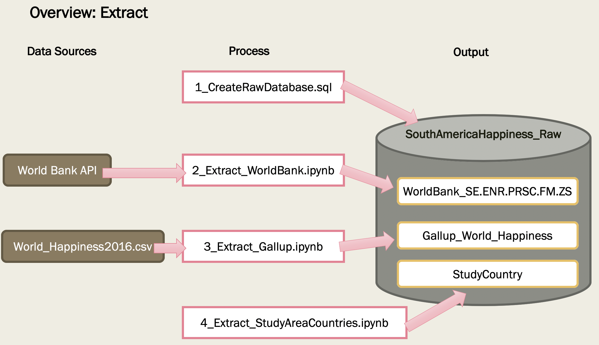
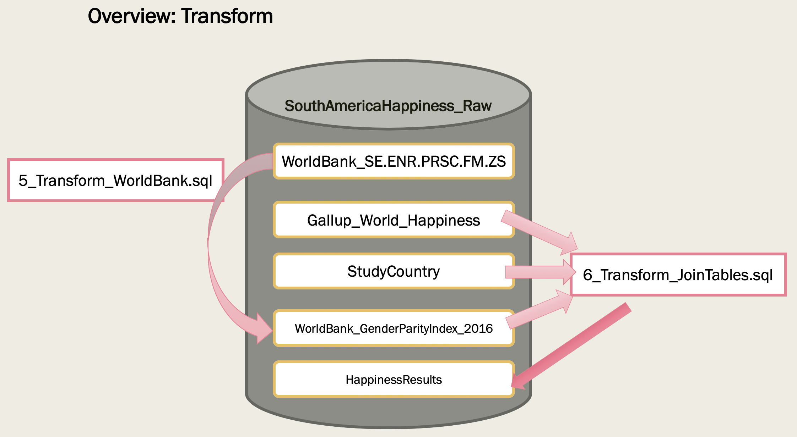
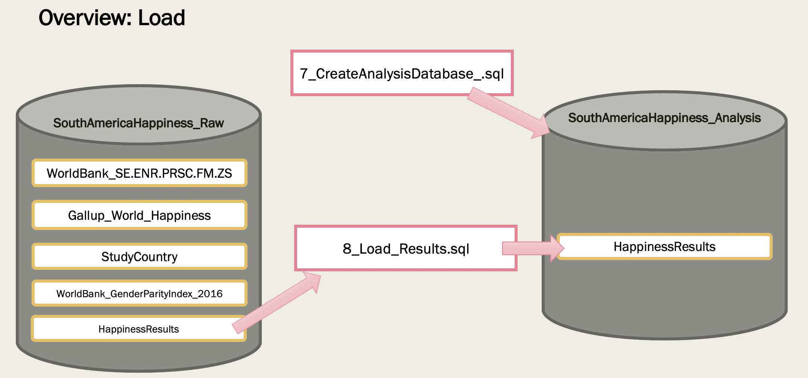

# ETL_Project

# Project Proposal 

We will be analyzing World Happiness rankings and their relationship to gender parity indicator for school enrollment. The primary focus will be on South America, which has a significant range in happiness rankings and has a greater presence of females in school than average. 

## Sources
### Kaggle
https://www.kaggle.com/unsdsn/world-happiness
Download the CSV File 2016
Focus on Latin America and Caribbean

### World Bank API Call
School Enrollment Index
https://data.worldbank.org/indicator/SE.ENR.PRSC.FM.ZS?view=chart

## Database moving into
SouthAmericaHappiness_Raw
SouthAmericaHappiness_Analysis

## What Final Output Will Look like
A new MySql database with a table named HappinessResults that will contain information on South American countries. The areas we explored included gender parity in school enrollment, the happiness rank, happiness score, influence of the economy on happiness, influence of family on happiness, and influence of freedom on happiness. This will allow someone to compare happiness scores and ranks with other factors that might be contributing to populations overall happiness. 

### Description of the columns
Indicator: Gender parity index for gross enrollment ratio in primary and secondary education is the ratio of girls to boys enrolled at primary and secondary levels in public and private schools. A GPI of 1 indicates parity between the sexes; a GPI that varies between 0 and 1 typically means a disparity in favour of males; whereas a GPI greater than 1 indicates a disparity in favour of females.

Happiness Rank: This is the countries rank based on The World Happiness Report, which ranked 155 countries by their level of happiness. 

Happiness Score: The scores are based on answers to the main life evaluation question asked in the poll. This question, known as the Cantril ladder, asks respondents to think of a ladder with the best possible life for them being a 10 and the worst possible life being a 0 and to rate their own current lives on that scale. The scores are from nationally representative samples for the years 2013-2016 and use the Gallup weights to make the estimates representative. 

Influence of Economy: This is an estimation of the impact that the county's economic production influences residence happiness. 

Influence of Family: The extent to which Family contributes to the calculation of the Happiness Score.

Influence of Freedom: The extent to which Freedom contributed to the calculation of the Happiness Score.

## MEMBERS:

Scott McEachern   
Robert Sayler   
Connie Hu   

# Extract

## 1 Create RAW Database
Create MySQL database named 'SouthAmericaHappiness_Raw' that is to contain the extracted datasets.

- Source: 1_CreateRawDatabase.sql  
- Environment: MySQL Workbench  

## 2 Extract: World Bank Indicator
Extract the 'School Enrollment, primary and secondary (gross), gender parity index (GPI)' from the World Bank API.  The 'pandas_datareader' library is used to pull the data from the World Bank API into a DataFrame which is then loaded into the 'WorldBank_SE.ENR.PRSC.FM.ZS' table in the 'SouthAmericaHappiness_Raw' MySQL database. 

- Source: 2_Extract_WorldBank.ipynb
- Environment: Jupyter Notebook
  
## 3 Extract: Gallup World Happiness
The 'World_Happiness2016.csv' has been downloaded from the Gallup website and is then loaded into the 'Gallup_World_Happiness' table in the 'SouthAmericaHappiness_Raw' MySQL database.

- Source: 3_Extract_Gallup.ipynb
- Environment: Jupyter Notebook

## 4 Extract: Study Countries
The 'StudyCountry' table is created within the 'SouthAmericaHappiness_Raw' MySQL database that contains a list of all of the countries that are to be used in the study.  Wikipedia as the source for the list of the South American countries.

- Source: 4_Extract_StudyAreaCountries.ipynb
- Environment: Jupyter Notebook
  

# Transform

## 5 Transform: World Bank Data
A new table within the 'SouthAmericaHappiness_Raw' MySQL database named 'WorldBank_GenderParityIndex_2016' that contains the World Bank data for just the year 2016.  Then within this new table, the names have the countries are updated to ensure it matches the other data sources.

- Source: 5_Transform_WorldBank.sql
- Environment: MySQL Workbench

## 6 Transform: Join Datasets
A new table, 'HappinessResults' is to be created in the 'SouthAmericaHappiness_Raw' MySQL database that joins together the data form the 'WorldBank_GenderParityIndex_2016', 'StudyCountry' and 'Gallup_World_Happiness" tables.  Records that had NULL values for the World Bank Gender Parity Index are not include.  

- Source: 6_Transform_JoinTables.sql
- Environment: MySQL Workbench

# Load

## 6 Create Analysis Database
Create a new MySQL database named 'SouthAmericaHappiness_Analysis' that is to contain the datasets used for the analysis.

- Source: 6_CreateAnalysisDatabase.sql
- Environment: MySQL Workbench

## 7 Load: Results
Creates a new table, "HappinessResults", in the 'SouthAmericaHappiness_Analysis' MySQL database that contains the transformed data from the 'WorldBank_GenderParityIndex_2016', 'StudyCountry' and 'Gallup_World_Happiness" tables 
found in the 'SouthAmericaHappiness_Raw' MySQL database.

- Source: 7_Load_Results.sql
- Environment: MySQL Workbench 

